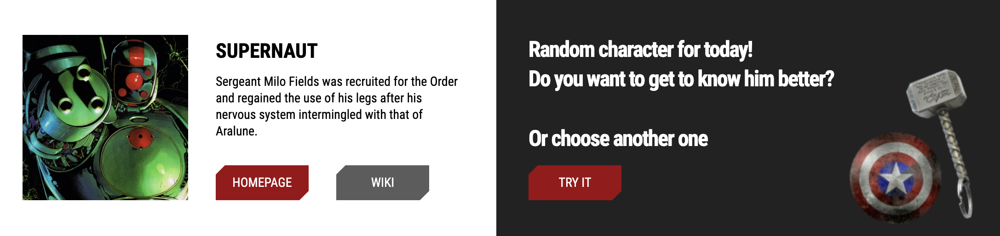
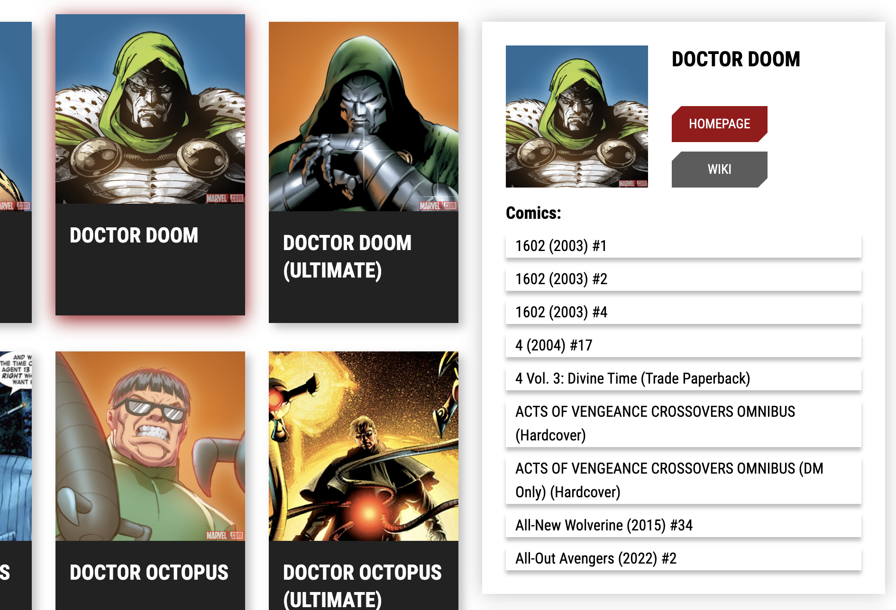
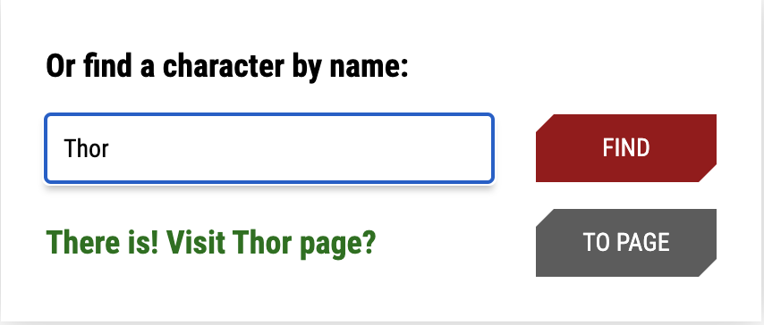
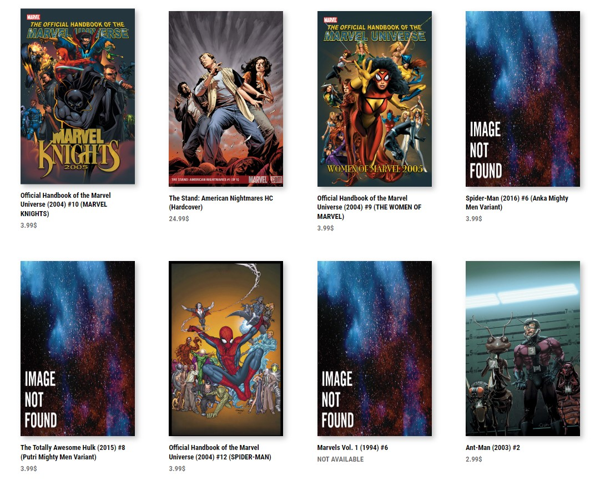

# :superhero_man: React Marvel

Discover the Marvel Universe with the React Marvel app.\
Here you can find information about your favorite Marvel character and find comics with him.

## Features

### Find information about the characters

-   Pick a random character
    <details>
          <summary className="px-3 py-1 rounded-5 text-primary">
            Show screenshot
          </summary>
          
    </details>

-   Pick a specific character from the list
    <details>
        <summary className="px-3 py-1 rounded-5 text-primary">
          Show screenshot
        </summary>
        
    </details>

-   Enter character's name on a form
    <details>
          <summary className="px-3 py-1 rounded-5 text-primary">
            Show screenshot
          </summary>
          
    </details>

### Find information about the comics

In comics page select the comic you're interested in.

<details>
      <summary className="px-3 py-1 rounded-5 text-primary">
        Show screenshots
      </summary>
      
      
</details>

## Stack

- React.JS
- React Router
- React Helmet
- Formik
- Yup
- SCSS
- <a href="https://developer.marvel.com/">Marvel Comics API</a>

## How to run

1. Clone this repo and go to the cloned folder.

```sh
$> git clone https://github.com/vgshenshin/Marvel-React.git && cd Marvel-React
```

2. Install all the dependencies

```sh
$> npm install
```

3. Run the application

```sh
$> npm start
```